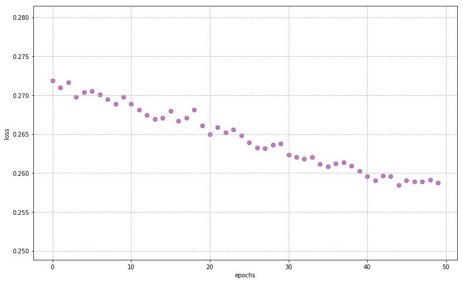

Most of this code can be found at <a href='https://keras.io'>keras.io</a>

## Questions
...

Multilayer Perceptron: Neural Network with multiple hidden layers


## Objectives 
YWBAT 
- build a neural network using keras
- compare models based on their depth
- *choose the best optimizer for a model*

### Why do we use NNs?
- identify combinations of features and learn combinations of features
- reduces the need for domain expertise

### Outline
* Import data
* Build single layer model
* Build 2 layer model
* Students build their own deep learning model
* evaluate models, tune optimizers

# Useful Imports


```python
import keras
import numpy as np
import pandas as pd

from sklearn.metrics import classification_report

import matplotlib.pyplot as plt
```


```python
from keras import models
from keras import layers
from keras import optimizers
```

# Obtaining Dataset & Train-Test Split

Nothing different from training other models


```python
from sklearn.datasets import load_iris
from sklearn.model_selection import train_test_split
from sklearn.preprocessing import OneHotEncoder, StandardScaler

iris = load_iris()
x = iris['data']
y = iris['target']
names = iris['target_names']
feature_names = iris['feature_names']

# One hot encoding
enc = OneHotEncoder()
y = enc.fit_transform(y[:, np.newaxis]).toarray()

# Scale data to have mean 0 and variance 1 
# which is importance for convergence of the neural network
scaler = StandardScaler()
x_scaled = scaler.fit_transform(x)

# Split the data set into training and testing
x_train, x_test, y_train, y_test = train_test_split(x_scaled, y, test_size=0.4, random_state=2)
```

    /anaconda3/lib/python3.7/site-packages/sklearn/preprocessing/_encoders.py:415: FutureWarning: The handling of integer data will change in version 0.22. Currently, the categories are determined based on the range [0, max(values)], while in the future they will be determined based on the unique values.
    If you want the future behaviour and silence this warning, you can specify "categories='auto'".
    In case you used a LabelEncoder before this OneHotEncoder to convert the categories to integers, then you can now use the OneHotEncoder directly.
      warnings.warn(msg, FutureWarning)


```python
"""
Attribute Information:

fLength: continuous # major axis of ellipse [mm]
fWidth: continuous # minor axis of ellipse [mm]
fSize: continuous # 10-log of sum of content of all pixels [in #phot]
fConc: continuous # ratio of sum of two highest pixels over fSize [ratio]
fConc1: continuous # ratio of highest pixel over fSize [ratio]
fAsym: continuous # distance from highest pixel to center, projected onto major axis [mm]
fM3Long: continuous # 3rd root of third moment along major axis [mm]
fM3Trans: continuous # 3rd root of third moment along minor axis [mm]
fAlpha: continuous # angle of major axis with vector to origin [deg]
fDist: continuous # distance from origin to center of ellipse [mm]
class: g,h # gamma (signal), hadron (background)
"""
```


    '\nAttribute Information:\n\nfLength: continuous # major axis of ellipse [mm]\nfWidth: continuous # minor axis of ellipse [mm]\nfSize: continuous # 10-log of sum of content of all pixels [in #phot]\nfConc: continuous # ratio of sum of two highest pixels over fSize [ratio]\nfConc1: continuous # ratio of highest pixel over fSize [ratio]\nfAsym: continuous # distance from highest pixel to center, projected onto major axis [mm]\nfM3Long: continuous # 3rd root of third moment along major axis [mm]\nfM3Trans: continuous # 3rd root of third moment along minor axis [mm]\nfAlpha: continuous # angle of major axis with vector to origin [deg]\nfDist: continuous # distance from origin to center of ellipse [mm]\nclass: g,h # gamma (signal), hadron (background)\n'


```python
### Let's load in some custom data
df = pd.read_csv("MagicTelescope.csv")
display(df.head(2))
df.drop("ID", axis=1, inplace=True)
df.head(2)
```


<div>
<style scoped>
    .dataframe tbody tr th:only-of-type {
        vertical-align: middle;
    }

    .dataframe tbody tr th {
        vertical-align: top;
    }

    .dataframe thead th {
        text-align: right;
    }
</style>
<table border="1" class="dataframe">
  <thead>
    <tr style="text-align: right;">
      <th></th>
      <th>ID</th>
      <th>fLength:</th>
      <th>fWidth:</th>
      <th>fSize:</th>
      <th>fConc:</th>
      <th>fConc1:</th>
      <th>fAsym:</th>
      <th>fM3Long:</th>
      <th>fM3Trans:</th>
      <th>fAlpha:</th>
      <th>fDist:</th>
      <th>class:</th>
    </tr>
  </thead>
  <tbody>
    <tr>
      <th>0</th>
      <td>1</td>
      <td>28.7967</td>
      <td>16.0021</td>
      <td>2.6449</td>
      <td>0.3918</td>
      <td>0.1982</td>
      <td>27.7004</td>
      <td>22.0110</td>
      <td>-8.2027</td>
      <td>40.0920</td>
      <td>81.8828</td>
      <td>g</td>
    </tr>
    <tr>
      <th>1</th>
      <td>2</td>
      <td>31.6036</td>
      <td>11.7235</td>
      <td>2.5185</td>
      <td>0.5303</td>
      <td>0.3773</td>
      <td>26.2722</td>
      <td>23.8238</td>
      <td>-9.9574</td>
      <td>6.3609</td>
      <td>205.2610</td>
      <td>g</td>
    </tr>
  </tbody>
</table>
</div>


<div>
<style scoped>
    .dataframe tbody tr th:only-of-type {
        vertical-align: middle;
    }

    .dataframe tbody tr th {
        vertical-align: top;
    }

    .dataframe thead th {
        text-align: right;
    }
</style>
<table border="1" class="dataframe">
  <thead>
    <tr style="text-align: right;">
      <th></th>
      <th>fLength:</th>
      <th>fWidth:</th>
      <th>fSize:</th>
      <th>fConc:</th>
      <th>fConc1:</th>
      <th>fAsym:</th>
      <th>fM3Long:</th>
      <th>fM3Trans:</th>
      <th>fAlpha:</th>
      <th>fDist:</th>
      <th>class:</th>
    </tr>
  </thead>
  <tbody>
    <tr>
      <th>0</th>
      <td>28.7967</td>
      <td>16.0021</td>
      <td>2.6449</td>
      <td>0.3918</td>
      <td>0.1982</td>
      <td>27.7004</td>
      <td>22.0110</td>
      <td>-8.2027</td>
      <td>40.0920</td>
      <td>81.8828</td>
      <td>g</td>
    </tr>
    <tr>
      <th>1</th>
      <td>31.6036</td>
      <td>11.7235</td>
      <td>2.5185</td>
      <td>0.5303</td>
      <td>0.3773</td>
      <td>26.2722</td>
      <td>23.8238</td>
      <td>-9.9574</td>
      <td>6.3609</td>
      <td>205.2610</td>
      <td>g</td>
    </tr>
  </tbody>
</table>
</div>


```python
X, y = df.drop('class:', axis=1), df["class:"]
y.shape
```


    (19020,)


```python
enc = OneHotEncoder()
y = enc.fit_transform(y[:, np.newaxis]).toarray()
y.shape, y
```


    ((19020, 2), array([[1., 0.],
            [1., 0.],
            [1., 0.],
            ...,
            [0., 1.],
            [0., 1.],
            [0., 1.]]))


```python
scaler = StandardScaler()
x_scaled = scaler.fit_transform(X)

# Split the data set into training and testing
x_train, x_test, y_train, y_test = train_test_split(x_scaled, y, test_size=0.4, random_state=2)
```


```python
x_train.shape, x_test.shape, y_train.shape, y_test.shape 
```


    ((11412, 10), (7608, 10), (11412, 2), (7608, 2))


# Creating a Neural Network

`Sequential` is referring to the neural networks we've observed. There are other neural network models that will go beyond this class.


```python
from keras.models import Sequential # this just means we go through our network in order of our layers

model = Sequential()
```

The actual network; we can decide how many layers & nodes for each layer here as well as other hyperparameters like the activation function.


```python
from keras.layers import Dense

model = Sequential()

# first hidden layer
model.add(Dense(units=32, activation='relu', input_dim=10)) 

# output layer
model.add(Dense(units=2, activation='softmax'))
```


```python
model.summary()
```

    _________________________________________________________________
    Layer (type)                 Output Shape              Param #   
    =================================================================
    dense_59 (Dense)             (None, 32)                352       
    _________________________________________________________________
    dense_60 (Dense)             (None, 2)                 66        
    =================================================================
    Total params: 418
    Trainable params: 418
    Non-trainable params: 0
    _________________________________________________________________


Compile the model to a form that the computer can more easily work with


```python
# gradient descent with momentum as our optimizer
model_optimizer = optimizers.SGD(lr=0.001, momentum=0.9, nesterov=True)

model.compile(loss=keras.losses.categorical_crossentropy, 
              optimizer=model_optimizer)
```

# Using the Model

Using the model structure, we do sequences of feedfoward and then backpropagation to adjust the weights and biases (training/fitting)


```python
history = model.fit(x_train, y_train, epochs=200, batch_size=32, verbose=1)
```

    Epoch 1/200
    11412/11412 [==============================] - 3s 303us/step - loss: 0.5710
    Epoch 2/200
    11412/11412 [==============================] - 1s 71us/step - loss: 0.4466: 0s - loss: 0.44 - ETA: 0s - loss: 0.44 - ETA: 0s - loss: 0.447
    Epoch 3/200
    11412/11412 [==============================] - 1s 66us/step - loss: 0.4187
    Epoch 4/200
    11412/11412 [==============================] - 1s 68us/step - loss: 0.4043: 0s - lo
    Epoch 5/200
    11412/11412 [==============================] - 1s 77us/step - loss: 0.3947
    Epoch 6/200
    11412/11412 [==============================] - 1s 80us/step - loss: 0.3875: 0s - loss: 0.38
    Epoch 7/200
    11412/11412 [==============================] - 1s 80us/step - loss: 0.3817: 0s - loss: 0.374 - ETA: 0s - loss: 
    Epoch 8/200
    11412/11412 [==============================] - 1s 75us/step - loss: 0.3768
    Epoch 9/200
    11412/11412 [==============================] - 1s 74us/step - loss: 0.3730
    Epoch 10/200
    11412/11412 [==============================] - 1s 80us/step - loss: 0.3693
    Epoch 11/200
    11412/11412 [==============================] - 1s 80us/step - loss: 0.3663
    Epoch 12/200
    11412/11412 [==============================] - 1s 89us/step - loss: 0.3631
    Epoch 13/200
    11412/11412 [==============================] - 1s 77us/step - loss: 0.3605
    Epoch 14/200
    11412/11412 [==============================] - 1s 71us/step - loss: 0.3581: 0s - lo
    Epoch 15/200
    11412/11412 [==============================] - 1s 66us/step - loss: 0.3558
    Epoch 16/200
    11412/11412 [==============================] - 1s 59us/step - loss: 0.3536
    Epoch 17/200
    11412/11412 [==============================] - 1s 64us/step - loss: 0.3516
    Epoch 18/200
    11412/11412 [==============================] - 1s 68us/step - loss: 0.3498
    Epoch 19/200
    11412/11412 [==============================] - ETA: 0s - loss: 0.347 - 1s 80us/step - loss: 0.3480
    Epoch 20/200
    11412/11412 [==============================] - 1s 95us/step - loss: 0.3463
    Epoch 21/200
    11412/11412 [==============================] - 1s 83us/step - loss: 0.3445: 0s - 
    Epoch 22/200
    11412/11412 [==============================] - 1s 75us/step - loss: 0.3432: 0s - 
    Epoch 23/200
    11412/11412 [==============================] - 1s 86us/step - loss: 0.3416
    Epoch 24/200
    11412/11412 [==============================] - 1s 78us/step - loss: 0.3404
    Epoch 25/200
    11412/11412 [==============================] - 1s 79us/step - loss: 0.3392
    Epoch 26/200
    11412/11412 [==============================] - 1s 74us/step - loss: 0.3380
    Epoch 27/200
    11412/11412 [==============================] - 1s 70us/step - loss: 0.3371
    Epoch 28/200
    11412/11412 [==============================] - 1s 72us/step - loss: 0.3362
    Epoch 29/200
    11412/11412 [==============================] - 1s 78us/step - loss: 0.3351: 0s - loss: 0.335
    Epoch 30/200
    11412/11412 [==============================] - 1s 74us/step - loss: 0.3342
    Epoch 31/200
    11412/11412 [==============================] - 1s 81us/step - loss: 0.3336
    Epoch 32/200
    11412/11412 [==============================] - 1s 84us/step - loss: 0.3329
    Epoch 33/200
    11412/11412 [==============================] - 1s 84us/step - loss: 0.3322
    Epoch 34/200
    11412/11412 [==============================] - 1s 73us/step - loss: 0.3315
    Epoch 35/200
    11412/11412 [==============================] - 1s 70us/step - loss: 0.3310
    Epoch 36/200
    11412/11412 [==============================] - 1s 92us/step - loss: 0.3305
    Epoch 37/200
    11412/11412 [==============================] - 1s 87us/step - loss: 0.3298
    Epoch 38/200
    11412/11412 [==============================] - 1s 82us/step - loss: 0.3291
    Epoch 39/200
    11412/11412 [==============================] - 1s 74us/step - loss: 0.3287
    Epoch 40/200
    11412/11412 [==============================] - 1s 78us/step - loss: 0.3282
    Epoch 41/200
    11412/11412 [==============================] - 1s 79us/step - loss: 0.3277: 0s - loss: 0
    Epoch 42/200
    11412/11412 [==============================] - 1s 73us/step - loss: 0.3272
    Epoch 43/200
    11412/11412 [==============================] - 1s 73us/step - loss: 0.3267
    Epoch 44/200
    11412/11412 [==============================] - 1s 73us/step - loss: 0.3262
    Epoch 45/200
    11412/11412 [==============================] - 1s 78us/step - loss: 0.3258
    Epoch 46/200
    11412/11412 [==============================] - 1s 81us/step - loss: 0.3251
    Epoch 47/200
    11412/11412 [==============================] - 1s 83us/step - loss: 0.3251
    Epoch 48/200
    11412/11412 [==============================] - 1s 84us/step - loss: 0.3247
    Epoch 49/200
    11412/11412 [==============================] - 1s 85us/step - loss: 0.3241
    Epoch 50/200
    11412/11412 [==============================] - 1s 80us/step - loss: 0.3239
    Epoch 51/200
    11412/11412 [==============================] - 1s 83us/step - loss: 0.3233: 0s - l
    Epoch 52/200
    11412/11412 [==============================] - 1s 76us/step - loss: 0.3230
    Epoch 53/200
    11412/11412 [==============================] - 1s 79us/step - loss: 0.3225
    Epoch 54/200
    11412/11412 [==============================] - 1s 71us/step - loss: 0.3224
    Epoch 55/200
    11412/11412 [==============================] - 1s 77us/step - loss: 0.3218: 0s - loss:
    Epoch 56/200
    11412/11412 [==============================] - 1s 75us/step - loss: 0.3214
    Epoch 57/200
    11412/11412 [==============================] - 1s 79us/step - loss: 0.3210
    Epoch 58/200
    11412/11412 [==============================] - 1s 80us/step - loss: 0.3208: 0s - loss:
    Epoch 59/200
    11412/11412 [==============================] - 1s 77us/step - loss: 0.3205
    Epoch 60/200
    11412/11412 [==============================] - 1s 79us/step - loss: 0.3200: 0s - loss: 
    Epoch 61/200
    11412/11412 [==============================] - 1s 73us/step - loss: 0.3198
    Epoch 62/200
    11412/11412 [==============================] - 1s 73us/step - loss: 0.3195
    Epoch 63/200
    11412/11412 [==============================] - 1s 71us/step - loss: 0.3192
    Epoch 64/200
    11412/11412 [==============================] - 1s 69us/step - loss: 0.3189
    Epoch 65/200
    11412/11412 [==============================] - 1s 81us/step - loss: 0.3184
    Epoch 66/200
    11412/11412 [==============================] - 1s 75us/step - loss: 0.3184
    Epoch 67/200
    11412/11412 [==============================] - 1s 70us/step - loss: 0.3177
    Epoch 68/200
    11412/11412 [==============================] - 1s 73us/step - loss: 0.3171
    Epoch 69/200
    11412/11412 [==============================] - 1s 78us/step - loss: 0.3172
    Epoch 70/200
    11412/11412 [==============================] - 1s 79us/step - loss: 0.3169
    Epoch 71/200
    11412/11412 [==============================] - 1s 80us/step - loss: 0.3167
    Epoch 72/200
    11412/11412 [==============================] - 1s 78us/step - loss: 0.3165: 0s - l
    Epoch 73/200
    11412/11412 [==============================] - 1s 76us/step - loss: 0.3160
    Epoch 74/200
    11412/11412 [==============================] - 1s 75us/step - loss: 0.3158: 0s - loss: 
    Epoch 75/200
    11412/11412 [==============================] - 1s 82us/step - loss: 0.3158
    Epoch 76/200
    11412/11412 [==============================] - 1s 81us/step - loss: 0.3154
    Epoch 77/200
    11412/11412 [==============================] - 1s 105us/step - loss: 0.3149
    Epoch 78/200
    11412/11412 [==============================] - 1s 93us/step - loss: 0.3149
    Epoch 79/200
    11412/11412 [==============================] - 1s 85us/step - loss: 0.3144: 0s - loss: 0
    Epoch 80/200
    11412/11412 [==============================] - 1s 85us/step - loss: 0.3142:
    Epoch 81/200
    11412/11412 [==============================] - 1s 80us/step - loss: 0.3137: 0s - lo
    Epoch 82/200
    11412/11412 [==============================] - 1s 82us/step - loss: 0.3138
    Epoch 83/200
    11412/11412 [==============================] - 1s 76us/step - loss: 0.3133
    Epoch 84/200
    11412/11412 [==============================] - 1s 81us/step - loss: 0.3133
    Epoch 85/200
    11412/11412 [==============================] - 1s 90us/step - loss: 0.3130
    Epoch 86/200
    11412/11412 [==============================] - 1s 91us/step - loss: 0.3130
    Epoch 87/200
    11412/11412 [==============================] - 1s 88us/step - loss: 0.3128
    Epoch 88/200
    11412/11412 [==============================] - 1s 97us/step - loss: 0.3124
    Epoch 89/200
    11412/11412 [==============================] - 1s 82us/step - loss: 0.3121
    Epoch 90/200
    11412/11412 [==============================] - 1s 80us/step - loss: 0.3120
    Epoch 91/200
    11412/11412 [==============================] - 1s 78us/step - loss: 0.3118
    Epoch 92/200
    11412/11412 [==============================] - 1s 77us/step - loss: 0.3115: 0s - loss: 0.311 - ETA: 0s - los
    Epoch 93/200
    11412/11412 [==============================] - 1s 79us/step - loss: 0.3114
    Epoch 94/200
    11412/11412 [==============================] - 1s 73us/step - loss: 0.3111
    Epoch 95/200
    11412/11412 [==============================] - 1s 78us/step - loss: 0.3106
    Epoch 96/200
    11412/11412 [==============================] - 1s 75us/step - loss: 0.3106
    Epoch 97/200
    11412/11412 [==============================] - 1s 71us/step - loss: 0.3102
    Epoch 98/200
    11412/11412 [==============================] - 1s 78us/step - loss: 0.3098
    Epoch 99/200
    11412/11412 [==============================] - 1s 88us/step - loss: 0.3100
    Epoch 100/200
    11412/11412 [==============================] - 1s 85us/step - loss: 0.3095: 0s - loss: 0.
    Epoch 101/200
    11412/11412 [==============================] - 1s 96us/step - loss: 0.3094: 0s - loss: 0
    Epoch 102/200
    11412/11412 [==============================] - 1s 89us/step - loss: 0.3091
    Epoch 103/200
    11412/11412 [==============================] - 1s 93us/step - loss: 0.3089
    Epoch 104/200
    11412/11412 [==============================] - 1s 79us/step - loss: 0.3086: 0s - loss: 0.2 - ETA: 0s - loss: 0.302 - ETA: 0s - loss: 
    Epoch 105/200
    11412/11412 [==============================] - 1s 80us/step - loss: 0.3084
    Epoch 106/200
    11412/11412 [==============================] - 1s 90us/step - loss: 0.3085
    Epoch 107/200
    11412/11412 [==============================] - 1s 74us/step - loss: 0.3084: 0s - lo
    Epoch 108/200
    11412/11412 [==============================] - 1s 79us/step - loss: 0.3083
    Epoch 109/200
    11412/11412 [==============================] - 1s 77us/step - loss: 0.3078
    Epoch 110/200
    11412/11412 [==============================] - 1s 75us/step - loss: 0.3078
    Epoch 111/200
    11412/11412 [==============================] - 1s 74us/step - loss: 0.3074
    Epoch 112/200
    11412/11412 [==============================] - 1s 78us/step - loss: 0.3072
    Epoch 113/200
    11412/11412 [==============================] - 1s 69us/step - loss: 0.3072: 0s - loss: 0.3
    Epoch 114/200
    11412/11412 [==============================] - 1s 60us/step - loss: 0.3066
    Epoch 115/200
    11412/11412 [==============================] - 1s 66us/step - loss: 0.3067
    Epoch 116/200
    11412/11412 [==============================] - 1s 78us/step - loss: 0.3067
    Epoch 117/200
    11412/11412 [==============================] - 1s 89us/step - loss: 0.3062
    Epoch 118/200
    11412/11412 [==============================] - 1s 84us/step - loss: 0.3062
    Epoch 119/200
    11412/11412 [==============================] - 1s 80us/step - loss: 0.3059
    Epoch 120/200
    11412/11412 [==============================] - 1s 78us/step - loss: 0.3060
    Epoch 121/200
    11412/11412 [==============================] - 1s 77us/step - loss: 0.3055
    Epoch 122/200
    11412/11412 [==============================] - 1s 76us/step - loss: 0.3057
    Epoch 123/200
    11412/11412 [==============================] - 1s 78us/step - loss: 0.3053: 0
    Epoch 124/200
    11412/11412 [==============================] - 1s 78us/step - loss: 0.3047
    Epoch 125/200
    11412/11412 [==============================] - ETA: 0s - loss: 0.304 - 1s 77us/step - loss: 0.3050
    Epoch 126/200
    11412/11412 [==============================] - 1s 74us/step - loss: 0.3049
    Epoch 127/200
    11412/11412 [==============================] - 1s 79us/step - loss: 0.3045
    Epoch 128/200
    11412/11412 [==============================] - 1s 79us/step - loss: 0.3043
    Epoch 129/200
    11412/11412 [==============================] - 1s 77us/step - loss: 0.3043
    Epoch 130/200
    11412/11412 [==============================] - 1s 77us/step - loss: 0.3041: 0s - loss: 0.30
    Epoch 131/200
    11412/11412 [==============================] - 1s 75us/step - loss: 0.3038: 0s - loss: 0.302
    Epoch 132/200
    11412/11412 [==============================] - 1s 76us/step - loss: 0.3039
    Epoch 133/200
    11412/11412 [==============================] - 1s 73us/step - loss: 0.3035
    Epoch 134/200
    11412/11412 [==============================] - 1s 76us/step - loss: 0.3035
    Epoch 135/200
    11412/11412 [==============================] - 1s 77us/step - loss: 0.3032
    Epoch 136/200
    11412/11412 [==============================] - 1s 77us/step - loss: 0.3034
    Epoch 137/200
    11412/11412 [==============================] - 1s 70us/step - loss: 0.3030
    Epoch 138/200
    11412/11412 [==============================] - 1s 88us/step - loss: 0.3030
    Epoch 139/200
    11412/11412 [==============================] - 1s 78us/step - loss: 0.3027
    Epoch 140/200
    11412/11412 [==============================] - 1s 90us/step - loss: 0.3026
    Epoch 141/200
    11412/11412 [==============================] - 1s 95us/step - loss: 0.3026
    Epoch 142/200
    11412/11412 [==============================] - 1s 98us/step - loss: 0.3023: 0s - loss: 0.302
    Epoch 143/200
    11412/11412 [==============================] - 1s 97us/step - loss: 0.3022
    Epoch 144/200
    11412/11412 [==============================] - 1s 80us/step - loss: 0.3022
    Epoch 145/200
    11412/11412 [==============================] - 1s 86us/step - loss: 0.3018
    Epoch 146/200
    11412/11412 [==============================] - 1s 81us/step - loss: 0.3019: 0s - l
    Epoch 147/200
    11412/11412 [==============================] - 1s 76us/step - loss: 0.3019
    Epoch 148/200
    11412/11412 [==============================] - 1s 72us/step - loss: 0.3017
    Epoch 149/200
    11412/11412 [==============================] - 1s 77us/step - loss: 0.3016: 0s - loss: 0.3
    Epoch 150/200
    11412/11412 [==============================] - 1s 74us/step - loss: 0.3013
    Epoch 151/200
    11412/11412 [==============================] - 1s 78us/step - loss: 0.3007
    Epoch 152/200
    11412/11412 [==============================] - 1s 80us/step - loss: 0.3015
    Epoch 153/200
    11412/11412 [==============================] - 1s 77us/step - loss: 0.3009
    Epoch 154/200
    11412/11412 [==============================] - 1s 80us/step - loss: 0.3010
    Epoch 155/200
    11412/11412 [==============================] - 1s 77us/step - loss: 0.3010
    Epoch 156/200
    11412/11412 [==============================] - 1s 78us/step - loss: 0.3007
    Epoch 157/200
    11412/11412 [==============================] - 1s 74us/step - loss: 0.3006
    Epoch 158/200
    11412/11412 [==============================] - 1s 76us/step - loss: 0.3004
    Epoch 159/200
    11412/11412 [==============================] - 1s 78us/step - loss: 0.3007
    Epoch 160/200
    11412/11412 [==============================] - 1s 75us/step - loss: 0.3001
    Epoch 161/200
    11412/11412 [==============================] - 1s 81us/step - loss: 0.3005
    Epoch 162/200
    11412/11412 [==============================] - 1s 76us/step - loss: 0.3000
    Epoch 163/200
    11412/11412 [==============================] - 1s 78us/step - loss: 0.3000
    Epoch 164/200
    11412/11412 [==============================] - 1s 76us/step - loss: 0.2998
    Epoch 165/200
    11412/11412 [==============================] - 1s 77us/step - loss: 0.2996
    Epoch 166/200
    11412/11412 [==============================] - 1s 78us/step - loss: 0.2995
    Epoch 167/200
    11412/11412 [==============================] - 1s 74us/step - loss: 0.2999
    Epoch 168/200
    11412/11412 [==============================] - 1s 79us/step - loss: 0.2993
    Epoch 169/200
    11412/11412 [==============================] - 1s 78us/step - loss: 0.2994
    Epoch 170/200
    11412/11412 [==============================] - 1s 76us/step - loss: 0.2992
    Epoch 171/200
    11412/11412 [==============================] - 1s 75us/step - loss: 0.2993: 0s - lo
    Epoch 172/200
    11412/11412 [==============================] - 1s 82us/step - loss: 0.2992
    Epoch 173/200
    11412/11412 [==============================] - 1s 83us/step - loss: 0.2990
    Epoch 174/200
    11412/11412 [==============================] - 1s 77us/step - loss: 0.2990
    Epoch 175/200
    11412/11412 [==============================] - 1s 76us/step - loss: 0.2986
    Epoch 176/200
    11412/11412 [==============================] - 1s 79us/step - loss: 0.2989
    Epoch 177/200
    11412/11412 [==============================] - 1s 79us/step - loss: 0.2984
    Epoch 178/200
    11412/11412 [==============================] - 1s 78us/step - loss: 0.2982
    Epoch 179/200
    11412/11412 [==============================] - 1s 74us/step - loss: 0.2980
    Epoch 180/200
    11412/11412 [==============================] - 1s 70us/step - loss: 0.2984
    Epoch 181/200
    11412/11412 [==============================] - 1s 83us/step - loss: 0.2984
    Epoch 182/200
    11412/11412 [==============================] - 1s 81us/step - loss: 0.2978
    Epoch 183/200
    11412/11412 [==============================] - 1s 87us/step - loss: 0.2979
    Epoch 184/200
    11412/11412 [==============================] - 1s 75us/step - loss: 0.2980
    Epoch 185/200
    11412/11412 [==============================] - 1s 79us/step - loss: 0.2978
    Epoch 186/200
    11412/11412 [==============================] - 1s 77us/step - loss: 0.2975: 0s - loss: 0.29
    Epoch 187/200
    11412/11412 [==============================] - 1s 72us/step - loss: 0.2978
    Epoch 188/200
    11412/11412 [==============================] - 1s 68us/step - loss: 0.2974
    Epoch 189/200
    11412/11412 [==============================] - 1s 69us/step - loss: 0.2972
    Epoch 190/200
    11412/11412 [==============================] - 1s 69us/step - loss: 0.2973
    Epoch 191/200
    11412/11412 [==============================] - 1s 68us/step - loss: 0.2973
    Epoch 192/200
    11412/11412 [==============================] - 1s 57us/step - loss: 0.2971
    Epoch 193/200
    11412/11412 [==============================] - 1s 59us/step - loss: 0.2972
    Epoch 194/200
    11412/11412 [==============================] - 1s 75us/step - loss: 0.2969
    Epoch 195/200
    11412/11412 [==============================] - 1s 77us/step - loss: 0.2968
    Epoch 196/200
    11412/11412 [==============================] - 1s 74us/step - loss: 0.2967
    Epoch 197/200
    11412/11412 [==============================] - 1s 69us/step - loss: 0.2969
    Epoch 198/200
    11412/11412 [==============================] - 1s 69us/step - loss: 0.2969: 0s - loss: 0.
    Epoch 199/200
    11412/11412 [==============================] - 1s 69us/step - loss: 0.2963
    Epoch 200/200
    11412/11412 [==============================] - 1s 70us/step - loss: 0.2964


```python
def plot_history(history, figsize=(13, 8), color='purple', s=50, alpha=0.5):
    plt.figure(figsize=figsize)
    plt.grid(zorder=0, linestyle='--')
    plt.scatter(history.epoch, history.history["loss"], c=color, s=s, alpha=alpha)
    plt.xlabel("epochs")
    plt.ylabel("loss")
    plt.show()
    
    
plot_history(history)
```


# Evaluating the Trained Model

We can look at the overall loss from our test data after training the model was trained


```python
# Could also just use a batch to evaluate
loss_and_metrics = model.evaluate(x_test, y_test)

loss_and_metrics
```

    7608/7608 [==============================] - 1s 160us/step


    0.326356510634678


We can have predictions (probability the data point is a particular class based on our trained model)


```python
probs = model.predict(x_test)
probs[:3]
```


    array([[0.9566773 , 0.04332269],
           [0.6763478 , 0.32365215],
           [0.92335296, 0.07664701]], dtype=float32)


We want to say what is the predicted class, so we pick just the largest probability for each result


```python
predictions = np.argmax(probs, axis=1)

predictions[:3]
```


    array([0, 0, 0])


```python
np.sum(predictions  == np.argmax(y_test, axis=1)) / predictions.shape
```


    array([0.86869085])


```python
report = classification_report(y_test.argmax(axis=1), predictions, labels=[0, 1])
print(report)
```

                  precision    recall  f1-score   support
    
               0       0.87      0.93      0.90      4889
               1       0.86      0.75      0.80      2719
    
        accuracy                           0.87      7608
       macro avg       0.87      0.84      0.85      7608
    weighted avg       0.87      0.87      0.87      7608
    


Finally, we can see how accurate our model was by seeing if the predicted classes match the actual labels. Note that this is calculated differently from how the loss is calculated.

### But Behold!!!! An out of the box RFC comes into the fold! 


```python
from sklearn.ensemble import RandomForestClassifier
```


```python
clf = RandomForestClassifier()
```


```python
clf.fit(x_train, y_train)
```

    /anaconda3/lib/python3.7/site-packages/sklearn/ensemble/forest.py:245: FutureWarning: The default value of n_estimators will change from 10 in version 0.20 to 100 in 0.22.
      "10 in version 0.20 to 100 in 0.22.", FutureWarning)


    RandomForestClassifier(bootstrap=True, class_weight=None, criterion='gini',
                           max_depth=None, max_features='auto', max_leaf_nodes=None,
                           min_impurity_decrease=0.0, min_impurity_split=None,
                           min_samples_leaf=1, min_samples_split=2,
                           min_weight_fraction_leaf=0.0, n_estimators=10,
                           n_jobs=None, oob_score=False, random_state=None,
                           verbose=0, warm_start=False)


```python
clf_preds = clf.predict(x_test)
clf.score(x_test, y_test)
```


    0.8409568874868559


```python
report = classification_report(y_test, clf_preds)
print(report)
```

                  precision    recall  f1-score   support
    
               0       0.88      0.90      0.89      4889
               1       0.87      0.73      0.80      2719
    
       micro avg       0.88      0.84      0.86      7608
       macro avg       0.88      0.82      0.84      7608
    weighted avg       0.88      0.84      0.86      7608
     samples avg       0.84      0.84      0.84      7608
    


    /anaconda3/lib/python3.7/site-packages/sklearn/metrics/classification.py:1437: UndefinedMetricWarning: Precision and F-score are ill-defined and being set to 0.0 in samples with no predicted labels.
      'precision', 'predicted', average, warn_for)


### Let's add another Layer


```python
### Let's build a new model and add another layer
model_mlp = Sequential()


# hidden layers
model_mlp.add(Dense(input_dim=10, units=32, activation='relu'))
model_mlp.add(Dense(units=32, activation='relu'))


# classifier layer
model_mlp.add(Dense(units=2, activation='softmax'))


model_mlp.summary()
```

    _________________________________________________________________
    Layer (type)                 Output Shape              Param #   
    =================================================================
    dense_61 (Dense)             (None, 32)                352       
    _________________________________________________________________
    dense_62 (Dense)             (None, 32)                1056      
    _________________________________________________________________
    dense_63 (Dense)             (None, 2)                 66        
    =================================================================
    Total params: 1,474
    Trainable params: 1,474
    Non-trainable params: 0
    _________________________________________________________________


```python
model_mlp.compile(loss=keras.losses.categorical_crossentropy, 
                  optimizer=optimizers.SGD(lr=0.001, momentum=0.9, nesterov=True))

history_mlp = model_mlp.fit(x_train, y_train, epochs=100, batch_size=32, verbose=1)

plot_history(history_mlp)
```

    Epoch 1/100
    11412/11412 [==============================] - 3s 269us/step - loss: 0.5848 0s - loss: 
    Epoch 2/100
    11412/11412 [==============================] - 1s 89us/step - loss: 0.4602
    Epoch 3/100
    11412/11412 [==============================] - 1s 88us/step - loss: 0.4175
    Epoch 4/100
    11412/11412 [==============================] - 1s 89us/step - loss: 0.4010: 0s - l - ETA: 0s - loss: 0.401
    Epoch 5/100
    11412/11412 [==============================] - 1s 97us/step - loss: 0.3911
    Epoch 6/100
    11412/11412 [==============================] - 1s 99us/step - loss: 0.3838
    Epoch 7/100
    11412/11412 [==============================] - 1s 95us/step - loss: 0.3773
    Epoch 8/100
    11412/11412 [==============================] - 1s 87us/step - loss: 0.3715
    Epoch 9/100
    11412/11412 [==============================] - 1s 64us/step - loss: 0.3666
    Epoch 10/100
    11412/11412 [==============================] - 1s 71us/step - loss: 0.3623: 0s - loss: 
    Epoch 11/100
    11412/11412 [==============================] - 1s 78us/step - loss: 0.3586
    Epoch 12/100
    11412/11412 [==============================] - 1s 79us/step - loss: 0.3552
    Epoch 13/100
    11412/11412 [==============================] - 1s 75us/step - loss: 0.3519
    Epoch 14/100
    11412/11412 [==============================] - 1s 75us/step - loss: 0.3491: 0s - 
    Epoch 15/100
    11412/11412 [==============================] - 1s 87us/step - loss: 0.3462: 0s - loss: 0.
    Epoch 16/100
    11412/11412 [==============================] - 1s 86us/step - loss: 0.3435
    Epoch 17/100
    11412/11412 [==============================] - 1s 77us/step - loss: 0.3414
    Epoch 18/100
    11412/11412 [==============================] - 1s 84us/step - loss: 0.3385
    Epoch 19/100
    11412/11412 [==============================] - 1s 94us/step - loss: 0.3368: 0s - loss: 0.328 - ETA: 0s 
    Epoch 20/100
    11412/11412 [==============================] - 1s 98us/step - loss: 0.3341
    Epoch 21/100
    11412/11412 [==============================] - 1s 86us/step - loss: 0.3328
    Epoch 22/100
    11412/11412 [==============================] - 1s 84us/step - loss: 0.3303
    Epoch 23/100
    11412/11412 [==============================] - 1s 85us/step - loss: 0.3283
    Epoch 24/100
    11412/11412 [==============================] - 1s 78us/step - loss: 0.3266
    Epoch 25/100
    11412/11412 [==============================] - 1s 80us/step - loss: 0.3250
    Epoch 26/100
    11412/11412 [==============================] - 1s 80us/step - loss: 0.3233
    Epoch 27/100
    11412/11412 [==============================] - 1s 80us/step - loss: 0.3222
    Epoch 28/100
    11412/11412 [==============================] - 1s 78us/step - loss: 0.3206
    Epoch 29/100
    11412/11412 [==============================] - 1s 79us/step - loss: 0.3196
    Epoch 30/100
    11412/11412 [==============================] - 1s 80us/step - loss: 0.3184
    Epoch 31/100
    11412/11412 [==============================] - ETA: 0s - loss: 0.318 - 1s 80us/step - loss: 0.3172
    Epoch 32/100
    11412/11412 [==============================] - 1s 77us/step - loss: 0.3162
    Epoch 33/100
    11412/11412 [==============================] - 1s 77us/step - loss: 0.3152
    Epoch 34/100
    11412/11412 [==============================] - 1s 75us/step - loss: 0.3144
    Epoch 35/100
    11412/11412 [==============================] - 1s 76us/step - loss: 0.3134
    Epoch 36/100
    11412/11412 [==============================] - 1s 78us/step - loss: 0.3119: 0s - loss: 0 - ETA: 0s - loss: 0.311
    Epoch 37/100
    11412/11412 [==============================] - 1s 78us/step - loss: 0.3120
    Epoch 38/100
    11412/11412 [==============================] - 1s 87us/step - loss: 0.3112
    Epoch 39/100
    11412/11412 [==============================] - 1s 81us/step - loss: 0.3107: 0s -
    Epoch 40/100
    11412/11412 [==============================] - 1s 86us/step - loss: 0.3093
    Epoch 41/100
    11412/11412 [==============================] - 1s 91us/step - loss: 0.3089
    Epoch 42/100
    11412/11412 [==============================] - 1s 90us/step - loss: 0.3081
    Epoch 43/100
    11412/11412 [==============================] - 1s 93us/step - loss: 0.3072
    Epoch 44/100
    11412/11412 [==============================] - 1s 79us/step - loss: 0.3064: 0s - loss: 
    Epoch 45/100
    11412/11412 [==============================] - 1s 88us/step - loss: 0.3064: 0s - loss: 0.30
    Epoch 46/100
    11412/11412 [==============================] - 1s 88us/step - loss: 0.3056
    Epoch 47/100
    11412/11412 [==============================] - 1s 92us/step - loss: 0.3050
    Epoch 48/100
    11412/11412 [==============================] - 1s 89us/step - loss: 0.3043
    Epoch 49/100
    11412/11412 [==============================] - 1s 88us/step - loss: 0.3039
    Epoch 50/100
    11412/11412 [==============================] - 1s 85us/step - loss: 0.3038: 0s - los
    Epoch 51/100
    11412/11412 [==============================] - 1s 87us/step - loss: 0.3031: 0s - loss: 0.30
    Epoch 52/100
    11412/11412 [==============================] - 1s 83us/step - loss: 0.3027
    Epoch 53/100
    11412/11412 [==============================] - 1s 79us/step - loss: 0.3018
    Epoch 54/100
    11412/11412 [==============================] - 1s 97us/step - loss: 0.3016
    Epoch 55/100
    11412/11412 [==============================] - 1s 85us/step - loss: 0.3013
    Epoch 56/100
    11412/11412 [==============================] - 1s 85us/step - loss: 0.3010
    Epoch 57/100
    11412/11412 [==============================] - 1s 92us/step - loss: 0.3005
    Epoch 58/100
    11412/11412 [==============================] - 1s 87us/step - loss: 0.3002
    Epoch 59/100
    11412/11412 [==============================] - 1s 79us/step - loss: 0.3002
    Epoch 60/100
    11412/11412 [==============================] - 1s 82us/step - loss: 0.2998: 0s - loss: 0
    Epoch 61/100
    11412/11412 [==============================] - 1s 81us/step - loss: 0.2992
    Epoch 62/100
    11412/11412 [==============================] - 1s 88us/step - loss: 0.2983
    Epoch 63/100
    11412/11412 [==============================] - 1s 90us/step - loss: 0.2985: 0s - loss:  - ETA: 0s - loss: 0.2
    Epoch 64/100
    11412/11412 [==============================] - 1s 89us/step - loss: 0.2978
    Epoch 65/100
    11412/11412 [==============================] - 1s 96us/step - loss: 0.2982
    Epoch 66/100
    11412/11412 [==============================] - 1s 93us/step - loss: 0.2976
    Epoch 67/100
    11412/11412 [==============================] - 1s 94us/step - loss: 0.2975
    Epoch 68/100
    11412/11412 [==============================] - 1s 90us/step - loss: 0.2964
    Epoch 69/100
    11412/11412 [==============================] - 1s 96us/step - loss: 0.2970
    Epoch 70/100
    11412/11412 [==============================] - 1s 92us/step - loss: 0.2964
    Epoch 71/100
    11412/11412 [==============================] - 1s 87us/step - loss: 0.2961: 0s 
    Epoch 72/100
    11412/11412 [==============================] - 1s 90us/step - loss: 0.2960
    Epoch 73/100
    11412/11412 [==============================] - 1s 91us/step - loss: 0.2956
    Epoch 74/100
    11412/11412 [==============================] - 1s 91us/step - loss: 0.2955
    Epoch 75/100
    11412/11412 [==============================] - 1s 85us/step - loss: 0.2953: 0s -
    Epoch 76/100
    11412/11412 [==============================] - 1s 84us/step - loss: 0.2951
    Epoch 77/100
    11412/11412 [==============================] - 1s 92us/step - loss: 0.2945
    Epoch 78/100
    11412/11412 [==============================] - 1s 84us/step - loss: 0.2944: 0s - loss: 0.2
    Epoch 79/100
    11412/11412 [==============================] - 1s 84us/step - loss: 0.2935: 0s 
    Epoch 80/100
    11412/11412 [==============================] - 1s 93us/step - loss: 0.2937: 0s - l
    Epoch 81/100
    11412/11412 [==============================] - 1s 96us/step - loss: 0.2935
    Epoch 82/100
    11412/11412 [==============================] - 1s 74us/step - loss: 0.2929
    Epoch 83/100
    11412/11412 [==============================] - 1s 79us/step - loss: 0.2928
    Epoch 84/100
    11412/11412 [==============================] - 1s 91us/step - loss: 0.2927: 0s - 
    Epoch 85/100
    11412/11412 [==============================] - 1s 89us/step - loss: 0.2923
    Epoch 86/100
    11412/11412 [==============================] - 1s 90us/step - loss: 0.2922
    Epoch 87/100
    11412/11412 [==============================] - 1s 89us/step - loss: 0.2918
    Epoch 88/100
    11412/11412 [==============================] - 1s 85us/step - loss: 0.2914
    Epoch 89/100
    11412/11412 [==============================] - 1s 89us/step - loss: 0.2912: 0s - 
    Epoch 90/100
    11412/11412 [==============================] - 1s 87us/step - loss: 0.2914
    Epoch 91/100
    11412/11412 [==============================] - 1s 92us/step - loss: 0.2910
    Epoch 92/100
    11412/11412 [==============================] - 1s 104us/step - loss: 0.2904
    Epoch 93/100
    11412/11412 [==============================] - 1s 95us/step - loss: 0.2907
    Epoch 94/100
    11412/11412 [==============================] - 1s 82us/step - loss: 0.2898
    Epoch 95/100
    11412/11412 [==============================] - 1s 79us/step - loss: 0.2893
    Epoch 96/100
    11412/11412 [==============================] - 1s 77us/step - loss: 0.2892
    Epoch 97/100
    11412/11412 [==============================] - 1s 87us/step - loss: 0.2891
    Epoch 98/100
    11412/11412 [==============================] - 1s 95us/step - loss: 0.2889
    Epoch 99/100
    11412/11412 [==============================] - 1s 83us/step - loss: 0.2883
    Epoch 100/100
    11412/11412 [==============================] - 1s 79us/step - loss: 0.2884


```python
loss_and_metrics = model_mlp.evaluate(x_test, y_test)

loss_and_metrics
```

    7608/7608 [==============================] - 1s 166us/step


    0.32180120914265686


```python
probs = model_mlp.predict(x_test)
predictions = np.argmax(probs, axis=1)
np.sum(predictions  == np.argmax(y_test, axis=1)) / predictions.shape
```


    array([0.86987382])


```python
report = classification_report(y_test.argmax(axis=1), predictions, labels=[0, 1, 2])
print(report)
```

                  precision    recall  f1-score   support
    
               0       0.86      0.95      0.90      4889
               1       0.89      0.73      0.80      2719
               2       0.00      0.00      0.00         0
    
       micro avg       0.87      0.87      0.87      7608
       macro avg       0.58      0.56      0.57      7608
    weighted avg       0.87      0.87      0.87      7608
    


    /anaconda3/lib/python3.7/site-packages/sklearn/metrics/classification.py:1437: UndefinedMetricWarning: Precision and F-score are ill-defined and being set to 0.0 in labels with no predicted samples.
      'precision', 'predicted', average, warn_for)
    /anaconda3/lib/python3.7/site-packages/sklearn/metrics/classification.py:1439: UndefinedMetricWarning: Recall and F-score are ill-defined and being set to 0.0 in labels with no true samples.
      'recall', 'true', average, warn_for)


#### Add another layer and plot the loss


```python
# Build your model
model_mlp = Sequential()


# hidden layers
model_mlp.add(Dense(input_dim=10, units=16, activation='relu'))
model_mlp.add(Dense(units=32, activation='relu'))
model_mlp.add(Dense(units = 64, activation = 'relu'))

# classifier layer
model_mlp.add(Dense(units=2, activation='softmax'))


display(model_mlp.summary())

# Compile it


# fit your model using 100 epochs

```

    _________________________________________________________________
    Layer (type)                 Output Shape              Param #   
    =================================================================
    dense_66 (Dense)             (None, 16)                176       
    _________________________________________________________________
    dense_67 (Dense)             (None, 32)                544       
    _________________________________________________________________
    dense_68 (Dense)             (None, 64)                2112      
    _________________________________________________________________
    dense_69 (Dense)             (None, 2)                 130       
    =================================================================
    Total params: 2,962
    Trainable params: 2,962
    Non-trainable params: 0
    _________________________________________________________________


    None


```python
model_mlp.compile(loss=keras.losses.categorical_crossentropy, 
                  optimizer=optimizers.SGD(lr=0.001, momentum=0.9, nesterov=True))

history_mlp = model_mlp.fit(x_train, y_train, epochs=100, batch_size=32, verbose=1)

plot_history(history_mlp)
```

    Epoch 1/100
    11412/11412 [==============================] - 3s 290us/step - loss: 0.5433
    Epoch 2/100
    11412/11412 [==============================] - 1s 84us/step - loss: 0.4432
    Epoch 3/100
    11412/11412 [==============================] - 1s 84us/step - loss: 0.4137
    Epoch 4/100
    11412/11412 [==============================] - 1s 84us/step - loss: 0.3984
    Epoch 5/100
    11412/11412 [==============================] - 1s 82us/step - loss: 0.3867
    Epoch 6/100
    11412/11412 [==============================] - 1s 78us/step - loss: 0.3767
    Epoch 7/100
    11412/11412 [==============================] - 1s 79us/step - loss: 0.3688: 0s - loss: 0.369
    Epoch 8/100
    11412/11412 [==============================] - 1s 79us/step - loss: 0.3613
    Epoch 9/100
    11412/11412 [==============================] - 1s 91us/step - loss: 0.3558
    Epoch 10/100
    11412/11412 [==============================] - 1s 96us/step - loss: 0.3519
    Epoch 11/100
    11412/11412 [==============================] - 1s 83us/step - loss: 0.3484
    Epoch 12/100
    11412/11412 [==============================] - 1s 78us/step - loss: 0.3455
    Epoch 13/100
    11412/11412 [==============================] - 1s 81us/step - loss: 0.3428
    Epoch 14/100
    11412/11412 [==============================] - 1s 80us/step - loss: 0.3410: 0s - loss: 0.340
    Epoch 15/100
    11412/11412 [==============================] - 1s 81us/step - loss: 0.3387: 0s - lo
    Epoch 16/100
    11412/11412 [==============================] - 1s 79us/step - loss: 0.3367
    Epoch 17/100
    11412/11412 [==============================] - 1s 107us/step - loss: 0.3348 0s - loss: 0.3 - ETA: 0s - lo
    Epoch 18/100
    11412/11412 [==============================] - 1s 91us/step - loss: 0.3339
    Epoch 19/100
    11412/11412 [==============================] - 1s 84us/step - loss: 0.3318
    Epoch 20/100
    11412/11412 [==============================] - 1s 80us/step - loss: 0.3302
    Epoch 21/100
    11412/11412 [==============================] - 1s 80us/step - loss: 0.3289
    Epoch 22/100
    11412/11412 [==============================] - 1s 80us/step - loss: 0.3277: 0s - loss: 
    Epoch 23/100
    11412/11412 [==============================] - 1s 82us/step - loss: 0.3271: 0s - loss: 0.327
    Epoch 24/100
    11412/11412 [==============================] - 1s 84us/step - loss: 0.3252
    Epoch 25/100
    11412/11412 [==============================] - 1s 92us/step - loss: 0.3241
    Epoch 26/100
    11412/11412 [==============================] - 1s 92us/step - loss: 0.3228
    Epoch 27/100
    11412/11412 [==============================] - 1s 94us/step - loss: 0.3214
    Epoch 28/100
    11412/11412 [==============================] - 1s 88us/step - loss: 0.3201
    Epoch 29/100
    11412/11412 [==============================] - 1s 81us/step - loss: 0.3199
    Epoch 30/100
    11412/11412 [==============================] - 1s 79us/step - loss: 0.3186
    Epoch 31/100
    11412/11412 [==============================] - 1s 96us/step - loss: 0.3172
    Epoch 32/100
    11412/11412 [==============================] - 1s 97us/step - loss: 0.3169
    Epoch 33/100
    11412/11412 [==============================] - 1s 90us/step - loss: 0.3158
    Epoch 34/100
    11412/11412 [==============================] - 1s 84us/step - loss: 0.3154: 0s - loss: 0 - ETA: 0s -  - ETA: 0s - loss: 0.314
    Epoch 35/100
    11412/11412 [==============================] - 1s 95us/step - loss: 0.3141
    Epoch 36/100
    11412/11412 [==============================] - 1s 95us/step - loss: 0.3132: 0s - loss: 0.31
    Epoch 37/100
    11412/11412 [==============================] - 1s 85us/step - loss: 0.3127
    Epoch 38/100
    11412/11412 [==============================] - 1s 91us/step - loss: 0.3116
    Epoch 39/100
    11412/11412 [==============================] - 1s 86us/step - loss: 0.3112
    Epoch 40/100
    11412/11412 [==============================] - 1s 81us/step - loss: 0.3106
    Epoch 41/100
    11412/11412 [==============================] - 1s 82us/step - loss: 0.3105
    Epoch 42/100
    11412/11412 [==============================] - 1s 79us/step - loss: 0.3096
    Epoch 43/100
    11412/11412 [==============================] - 1s 80us/step - loss: 0.3093
    Epoch 44/100
    11412/11412 [==============================] - 1s 84us/step - loss: 0.3093
    Epoch 45/100
    11412/11412 [==============================] - 1s 90us/step - loss: 0.3077
    Epoch 46/100
    11412/11412 [==============================] - 1s 85us/step - loss: 0.3073:
    Epoch 47/100
    11412/11412 [==============================] - 1s 84us/step - loss: 0.3071
    Epoch 48/100
    11412/11412 [==============================] - 1s 97us/step - loss: 0.3061
    Epoch 49/100
    11412/11412 [==============================] - 1s 91us/step - loss: 0.3058
    Epoch 50/100
    11412/11412 [==============================] - 1s 85us/step - loss: 0.3058: 0s 
    Epoch 51/100
    11412/11412 [==============================] - 1s 79us/step - loss: 0.3046
    Epoch 52/100
    11412/11412 [==============================] - 1s 79us/step - loss: 0.3047
    Epoch 53/100
    11412/11412 [==============================] - 1s 82us/step - loss: 0.3038: 0s - loss: 0.304
    Epoch 54/100
    11412/11412 [==============================] - 1s 81us/step - loss: 0.3038
    Epoch 55/100
    11412/11412 [==============================] - 1s 95us/step - loss: 0.3030
    Epoch 56/100
    11412/11412 [==============================] - 1s 91us/step - loss: 0.3027
    Epoch 57/100
    11412/11412 [==============================] - 1s 85us/step - loss: 0.3024
    Epoch 58/100
    11412/11412 [==============================] - 1s 85us/step - loss: 0.3022
    Epoch 59/100
    11412/11412 [==============================] - 1s 95us/step - loss: 0.3014
    Epoch 60/100
    11412/11412 [==============================] - 1s 90us/step - loss: 0.3013
    Epoch 61/100
    11412/11412 [==============================] - 1s 88us/step - loss: 0.3003: 0s - loss: 0
    Epoch 62/100
    11412/11412 [==============================] - 1s 93us/step - loss: 0.3007
    Epoch 63/100
    11412/11412 [==============================] - 1s 92us/step - loss: 0.3002
    Epoch 64/100
    11412/11412 [==============================] - 1s 82us/step - loss: 0.2994
    Epoch 65/100
    11412/11412 [==============================] - 1s 83us/step - loss: 0.2998: 0s - loss - ETA: 0s - loss: 0.2
    Epoch 66/100
    11412/11412 [==============================] - 1s 83us/step - loss: 0.2987
    Epoch 67/100
    11412/11412 [==============================] - 1s 76us/step - loss: 0.2989
    Epoch 68/100
    11412/11412 [==============================] - 1s 82us/step - loss: 0.2981: 0s - loss: 
    Epoch 69/100
    11412/11412 [==============================] - 1s 82us/step - loss: 0.2983
    Epoch 70/100
    11412/11412 [==============================] - 1s 87us/step - loss: 0.2976
    Epoch 71/100
    11412/11412 [==============================] - 1s 84us/step - loss: 0.2973: 0s - lo
    Epoch 72/100
    11412/11412 [==============================] - 1s 94us/step - loss: 0.2975
    Epoch 73/100
    11412/11412 [==============================] - 1s 88us/step - loss: 0.2964
    Epoch 74/100
    11412/11412 [==============================] - 1s 71us/step - loss: 0.2969
    Epoch 75/100
    11412/11412 [==============================] - 1s 70us/step - loss: 0.2962
    Epoch 76/100
    11412/11412 [==============================] - 1s 82us/step - loss: 0.2958
    Epoch 77/100
    11412/11412 [==============================] - 1s 85us/step - loss: 0.2961
    Epoch 78/100
    11412/11412 [==============================] - 1s 87us/step - loss: 0.2957
    Epoch 79/100
    11412/11412 [==============================] - 1s 87us/step - loss: 0.2957
    Epoch 80/100
    11412/11412 [==============================] - 1s 82us/step - loss: 0.2947
    Epoch 81/100
    11412/11412 [==============================] - 1s 85us/step - loss: 0.2951
    Epoch 82/100
    11412/11412 [==============================] - 1s 96us/step - loss: 0.2944
    Epoch 83/100
    11412/11412 [==============================] - 1s 88us/step - loss: 0.2941
    Epoch 84/100
    11412/11412 [==============================] - 1s 85us/step - loss: 0.2941: 0s 
    Epoch 85/100
    11412/11412 [==============================] - 1s 81us/step - loss: 0.2940
    Epoch 86/100
    11412/11412 [==============================] - 1s 93us/step - loss: 0.2932
    Epoch 87/100
    11412/11412 [==============================] - 1s 88us/step - loss: 0.2934
    Epoch 88/100
    11412/11412 [==============================] - 1s 90us/step - loss: 0.2928
    Epoch 89/100
    11412/11412 [==============================] - 1s 88us/step - loss: 0.2924
    Epoch 90/100
    11412/11412 [==============================] - 1s 83us/step - loss: 0.2924
    Epoch 91/100
    11412/11412 [==============================] - 1s 82us/step - loss: 0.2922
    Epoch 92/100
    11412/11412 [==============================] - 1s 84us/step - loss: 0.2914
    Epoch 93/100
    11412/11412 [==============================] - 1s 92us/step - loss: 0.2915
    Epoch 94/100
    11412/11412 [==============================] - 1s 82us/step - loss: 0.2911
    Epoch 95/100
    11412/11412 [==============================] - 1s 92us/step - loss: 0.2911
    Epoch 96/100
    11412/11412 [==============================] - 1s 89us/step - loss: 0.2910
    Epoch 97/100
    11412/11412 [==============================] - 1s 88us/step - loss: 0.2910: 0s - loss: 0.29
    Epoch 98/100
    11412/11412 [==============================] - 1s 76us/step - loss: 0.2900
    Epoch 99/100
    11412/11412 [==============================] - 1s 88us/step - loss: 0.2904
    Epoch 100/100
    11412/11412 [==============================] - 1s 78us/step - loss: 0.2899


```python
# Evaluate your model
model_mlp.evaluate(x_test, y_test)
```

    7608/7608 [==============================] - 1s 149us/step


    0.3273864924656981


```python
# Plot your loss
plot_history(history_mlp)
```


```python
### Let's make it better
### Let's build a new model and add another layer
model_mlp = Sequential()


# hidden layers
model_mlp.add(Dense(input_dim=10, units=32, activation='relu'))
model_mlp.add(Dense(units=32, activation='relu'))


# classifier layer
model_mlp.add(Dense(units=2, activation='softmax'))


model_mlp.summary()
```

    _________________________________________________________________
    Layer (type)                 Output Shape              Param #   
    =================================================================
    dense_70 (Dense)             (None, 32)                352       
    _________________________________________________________________
    dense_71 (Dense)             (None, 32)                1056      
    _________________________________________________________________
    dense_72 (Dense)             (None, 2)                 66        
    =================================================================
    Total params: 1,474
    Trainable params: 1,474
    Non-trainable params: 0
    _________________________________________________________________


```python
model_mlp.compile(loss='categorical_crossentropy', optimizer=optimizers.Adam())
```


```python
history_mlp = model_mlp.fit(x_train, y_train, batch_size=64, epochs=50)
```

    Epoch 1/50
    11412/11412 [==============================] - 1s 48us/step - loss: 0.2719
    Epoch 2/50
    11412/11412 [==============================] - 1s 47us/step - loss: 0.2710
    Epoch 3/50
    11412/11412 [==============================] - 1s 51us/step - loss: 0.2717
    Epoch 4/50
    11412/11412 [==============================] - 1s 49us/step - loss: 0.2698
    Epoch 5/50
    11412/11412 [==============================] - 1s 48us/step - loss: 0.2704
    Epoch 6/50
    11412/11412 [==============================] - 1s 47us/step - loss: 0.2705
    Epoch 7/50
    11412/11412 [==============================] - 1s 49us/step - loss: 0.2701
    Epoch 8/50
    11412/11412 [==============================] - 1s 54us/step - loss: 0.2694
    Epoch 9/50
    11412/11412 [==============================] - 1s 49us/step - loss: 0.2689
    Epoch 10/50
    11412/11412 [==============================] - 1s 50us/step - loss: 0.2697
    Epoch 11/50
    11412/11412 [==============================] - 1s 52us/step - loss: 0.2689
    Epoch 12/50
    11412/11412 [==============================] - 1s 49us/step - loss: 0.2681
    Epoch 13/50
    11412/11412 [==============================] - 1s 50us/step - loss: 0.2674
    Epoch 14/50
    11412/11412 [==============================] - 1s 49us/step - loss: 0.2669
    Epoch 15/50
    11412/11412 [==============================] - 1s 53us/step - loss: 0.2671
    Epoch 16/50
    11412/11412 [==============================] - 1s 55us/step - loss: 0.2680
    Epoch 17/50
    11412/11412 [==============================] - 1s 48us/step - loss: 0.2667
    Epoch 18/50
    11412/11412 [==============================] - 1s 51us/step - loss: 0.2671
    Epoch 19/50
    11412/11412 [==============================] - 1s 49us/step - loss: 0.2681
    Epoch 20/50
    11412/11412 [==============================] - 1s 51us/step - loss: 0.2661
    Epoch 21/50
    11412/11412 [==============================] - 1s 50us/step - loss: 0.2650
    Epoch 22/50
    11412/11412 [==============================] - 1s 50us/step - loss: 0.2659
    Epoch 23/50
    11412/11412 [==============================] - 1s 47us/step - loss: 0.2652
    Epoch 24/50
    11412/11412 [==============================] - 1s 48us/step - loss: 0.2656
    Epoch 25/50
    11412/11412 [==============================] - 1s 47us/step - loss: 0.2648
    Epoch 26/50
    11412/11412 [==============================] - 1s 50us/step - loss: 0.2639
    Epoch 27/50
    11412/11412 [==============================] - 1s 48us/step - loss: 0.2633
    Epoch 28/50
    11412/11412 [==============================] - 1s 47us/step - loss: 0.2631
    Epoch 29/50
    11412/11412 [==============================] - 1s 51us/step - loss: 0.2636
    Epoch 30/50
    11412/11412 [==============================] - 1s 48us/step - loss: 0.2637
    Epoch 31/50
    11412/11412 [==============================] - 1s 44us/step - loss: 0.2623
    Epoch 32/50
    11412/11412 [==============================] - 1s 46us/step - loss: 0.2620
    Epoch 33/50
    11412/11412 [==============================] - 1s 46us/step - loss: 0.2618
    Epoch 34/50
    11412/11412 [==============================] - 1s 45us/step - loss: 0.2621
    Epoch 35/50
    11412/11412 [==============================] - 1s 49us/step - loss: 0.2611
    Epoch 36/50
    11412/11412 [==============================] - 1s 47us/step - loss: 0.2609
    Epoch 37/50
    11412/11412 [==============================] - 0s 39us/step - loss: 0.2612
    Epoch 38/50
    11412/11412 [==============================] - 0s 43us/step - loss: 0.2614
    Epoch 39/50
    11412/11412 [==============================] - 0s 37us/step - loss: 0.2609
    Epoch 40/50
    11412/11412 [==============================] - 1s 45us/step - loss: 0.2602
    Epoch 41/50
    11412/11412 [==============================] - 1s 50us/step - loss: 0.2596
    Epoch 42/50
    11412/11412 [==============================] - 1s 57us/step - loss: 0.2590
    Epoch 43/50
    11412/11412 [==============================] - 1s 51us/step - loss: 0.2596
    Epoch 44/50
    11412/11412 [==============================] - 1s 59us/step - loss: 0.2596
    Epoch 45/50
    11412/11412 [==============================] - 1s 55us/step - loss: 0.2585
    Epoch 46/50
    11412/11412 [==============================] - 1s 59us/step - loss: 0.2590
    Epoch 47/50
    11412/11412 [==============================] - 1s 59us/step - loss: 0.2589
    Epoch 48/50
    11412/11412 [==============================] - 1s 59us/step - loss: 0.2589
    Epoch 49/50
    11412/11412 [==============================] - 1s 54us/step - loss: 0.2591
    Epoch 50/50
    11412/11412 [==============================] - 1s 60us/step - loss: 0.2588: 0s - loss: 0


```python
plot_history(history_mlp)
```





```python
model_mlp.evaluate(x_test, y_test)
```

    7608/7608 [==============================] - 1s 197us/step


    0.33382856247302234


```python
probs = model_mlp.predict(x_test)
predictions = np.argmax(probs, axis=1)
np.sum(predictions  == np.argmax(y_test, axis=1)) / predictions.shape
```


    array([0.86119874])


```python
print(classification_report(y_test.argmax(axis=1), predictions))
```

                  precision    recall  f1-score   support
    
               0       0.87      0.92      0.90      4889
               1       0.84      0.75      0.79      2719
    
        accuracy                           0.86      7608
       macro avg       0.86      0.84      0.84      7608
    weighted avg       0.86      0.86      0.86      7608
    

